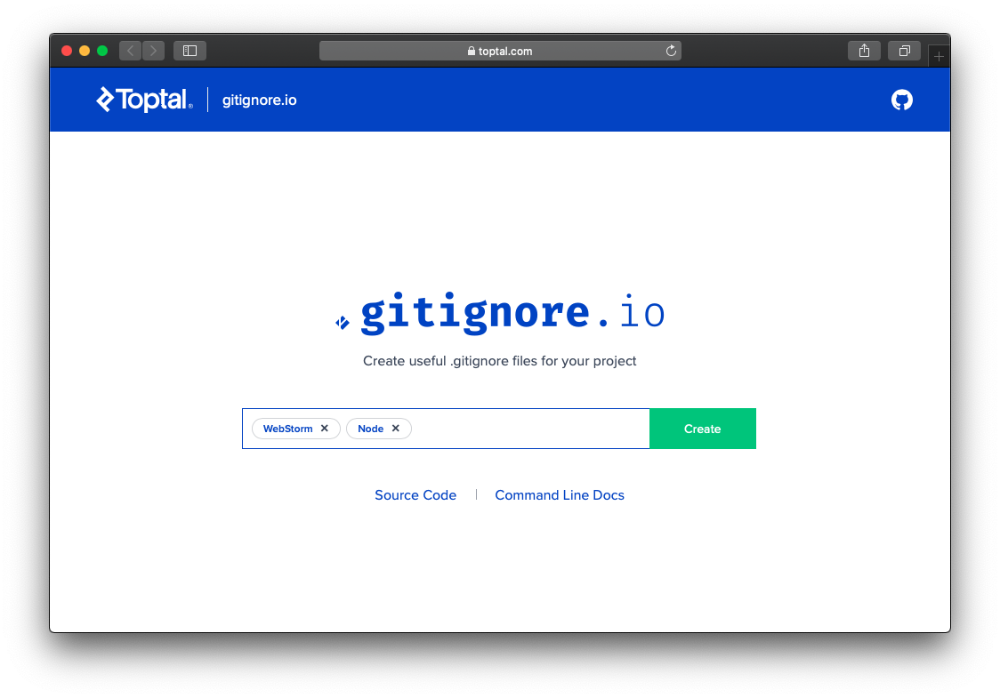
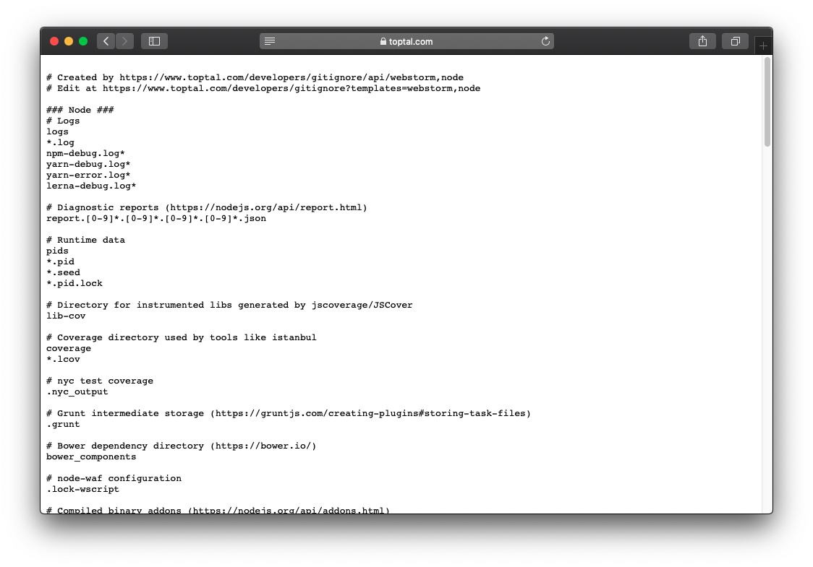

It is a good practice to have a .gitignore file that meets the requirements of your project,  this way we won't submit to our repository sensitive data, environment-specific files or dependencies that our Version Control System shouldn't manage. 

But every IDE, library, framework or language has a different set of files that needs to be ignored by git and is hard to create a .gitignore file for a new project, if you need to use a new IDE or framework probably you need to investigate if you should modify your .gitignore file according to that new tool, to save us a little of time and investigation we have gitignore.io

gitignore.io is a web that will generate a .gitignore file for us, all we need to do is write the tools, frameworks or languages we want to use, use the auto-completion to add each tool or technology to the selection and click on create.

gitignore.io will give us a file we can save directly from the browser and voila we have a new .gitignore file that includes all the files that should be ignored and is customized for our stack of technologies

Is always a good idea to check the file to see if there is some file ignored that you want to track it with git or to add your files that need to be ignored, it always depends on your project and your team but with gitignore.io we have a good base to start to modify.

I hope this tool as useful to you as it was for me. 